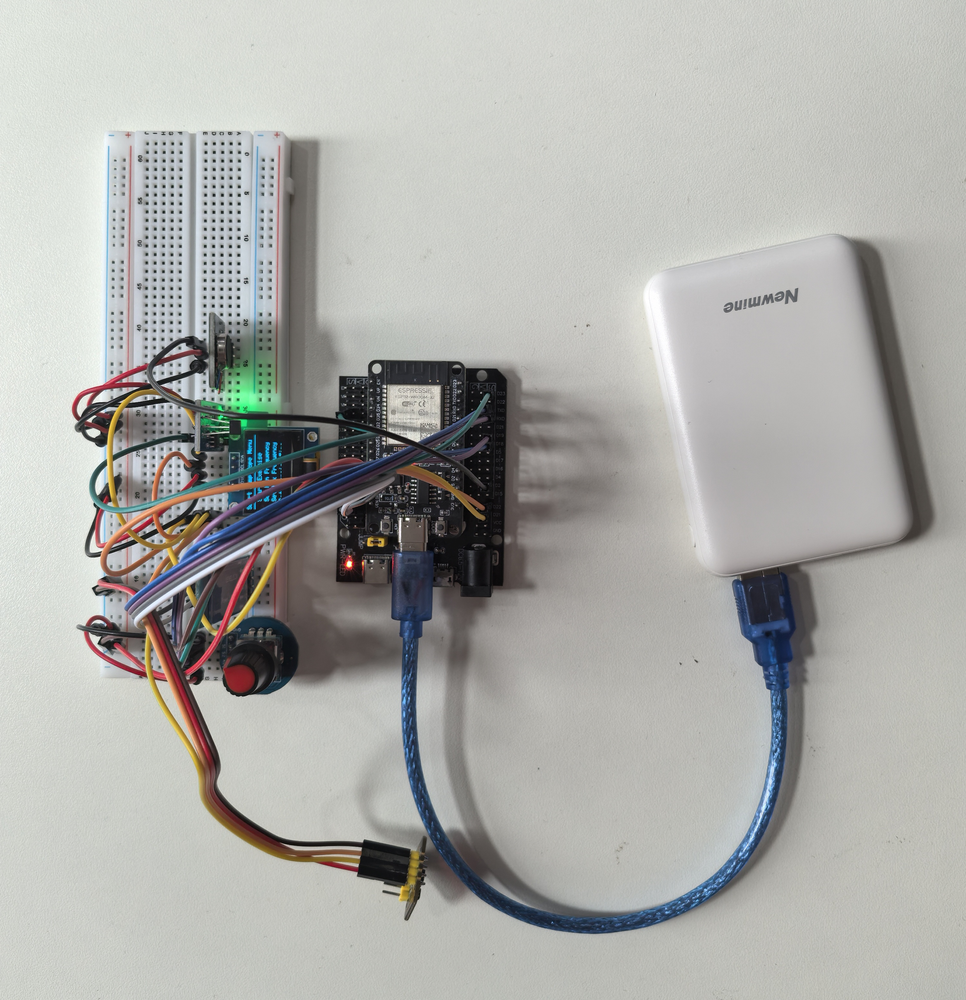
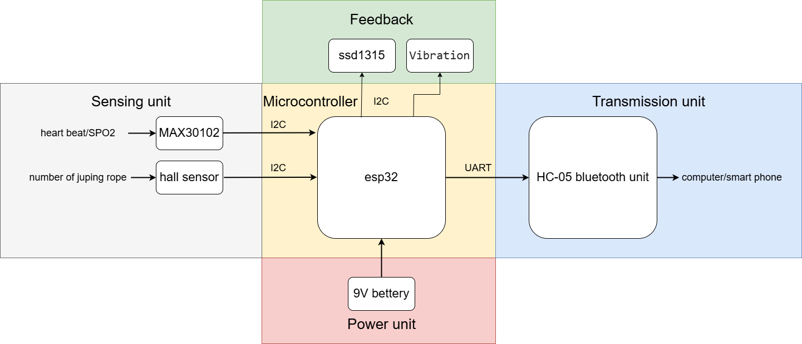
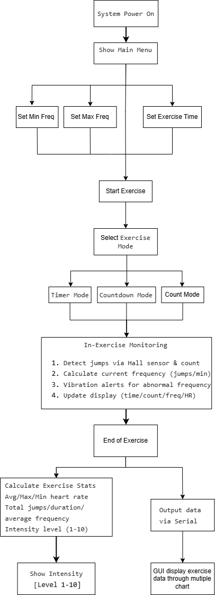
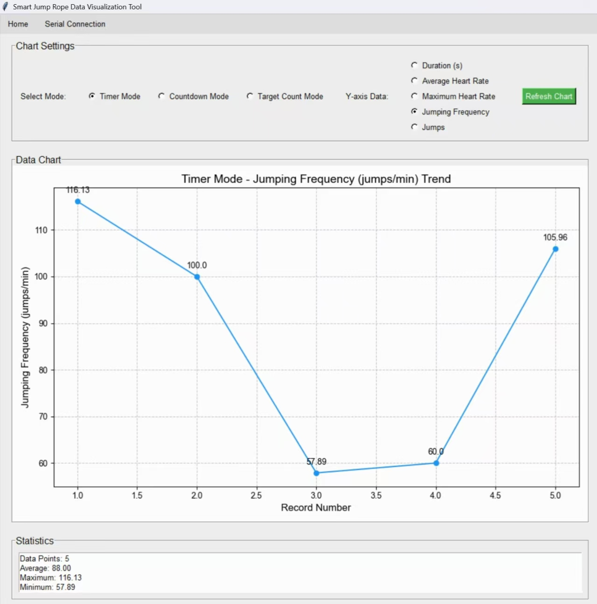
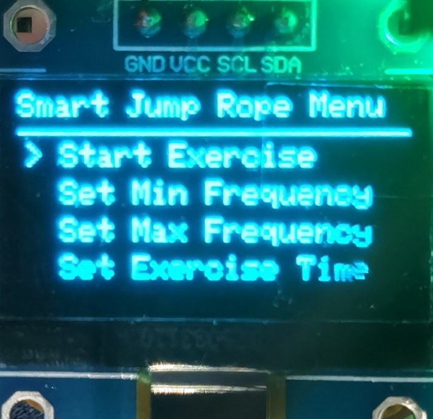
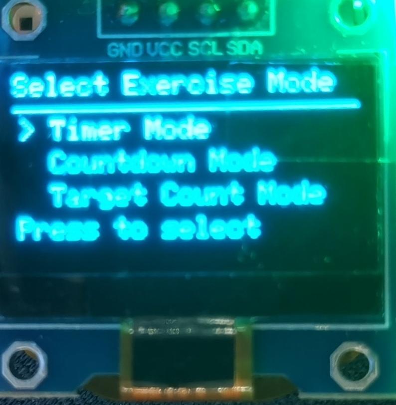
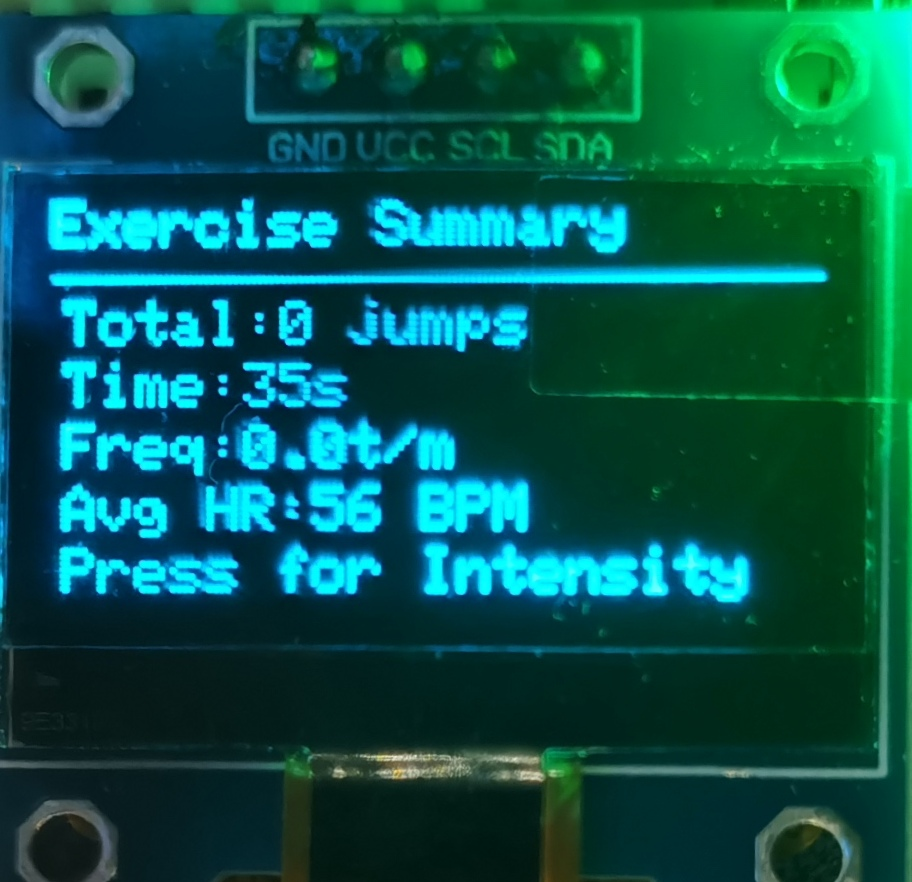
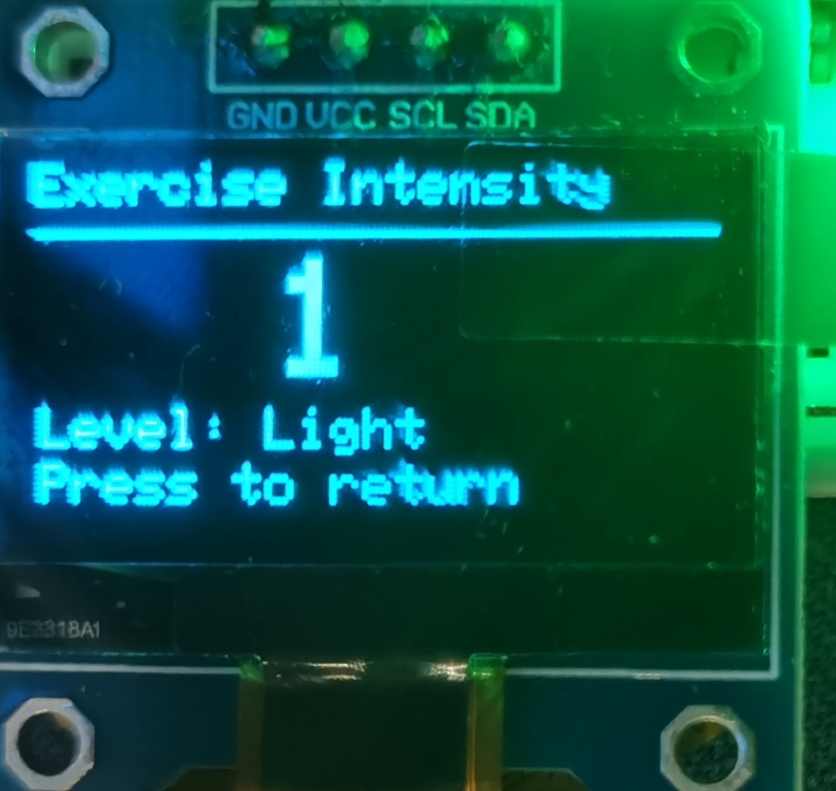

# 多功能智能跳绳——大一下认识实习小组项目 



## 前言
本项目为大一下学期认识实习课的小组任务，大部分开发及调试工作在两天内完成。由于时间十分紧迫，而且几乎所有用到的软/硬件均需要自学，因此其中很大一部分代码由AI协助完成。另外，由于任务没有对电路的集成化做要求，本项目仅仅将各个元件简单连接，以实现功能为主。
***

## 编程环境及库函数
本项目硬件部分基于esp32wroom32开发板，使用cpp在arduino IDE中编写；UI部分使用python编写。
硬件部分使用以下库：Adafruit BusIO，Adafruit GFX，Adafruit MPU6050，Adafruit SSD1306，Adafruit Unified Sensor，SparkFunMAX3010x。
UI部分使用以下库：tkinter，serial，matplotlib。
***

## 主要功能及实现
* 电子跳绳计数：3144霍尔传感器
* 实时心率监控：MAX30102心率血氧采集模块
* 运动水平评估：为各项运动表现设定权重值后计算得出10个等级
* 简单的运动目标设定：3种模式，可自定义个数/时长
* 实时运动信息反馈：运动中震动电机提示；运动结束后汇总显示运动水平、心率等
* 蓝牙连接：HC-05蓝牙模块
* 电脑端图形化显示界面：PyCharm
***

## 设计总览

*注：这门课是英方课，这里直接用了当时提交报告时画的图...*

系统框架：



流程图：

 

GUI：



菜单设计：

  
***

## 代码详解

*注：这里只有我负责写的硬件部分...*

* 库函数引用，变量声明：
```C
#include <Wire.h>
#include "MAX30105.h"       // 心率传感器库
#include "heartRate.h"     // 心率算法头文件
#include <Adafruit_GFX.h>  
#include <Adafruit_SSD1306.h>

// ------------------- 硬件与传感器相关定义 ------------------- //
#define SCREEN_WIDTH 128
#define SCREEN_HEIGHT 64
#define OLED_RESET -1
#define ENC_CLK 18    // 编码器CLK
#define ENC_DT 19     // 编码器DT
#define ENC_SW 23     // 编码器按键
#define HALL_PIN 34   // 霍尔传感器引脚
#define VIBRATION_PIN 2  // 振动电机控制引脚
#define HEART_RATE_BUFFER_SIZE 100  // 心率数据缓冲区大小

// 运动模式编码定义
const int TIMER_MODE = 0;
const int COUNTDOWN_MODE = 1;
const int TARGET_COUNT_MODE = 2;

// 振动频率定义(ms)
const int LOW_FREQ_VIB_INTERVAL = 500;  // 低频提醒间隔
const int HIGH_FREQ_VIB_INTERVAL = 200; // 高频提醒间隔
const int VIB_DURATION = 100;           // 每次振动持续时间

MAX30105 particleSensor;   // 心率传感器对象
Adafruit_SSD1306 display(SCREEN_WIDTH, SCREEN_HEIGHT, &Wire, OLED_RESET);

// ------------------- 菜单与运动状态定义 ------------------- //
enum MenuState {
  MAIN_MENU,
  SET_MIN_FREQ,
  SET_MAX_FREQ,
  SET_TIME,
  EXERCISE_MODE_SELECT,
  SET_TARGET_COUNT,
  EXERCISING_TIMER,
  EXERCISING_COUNTDOWN,
  EXERCISING_COUNTIN,
  EXERCISE_SUMMARY,
  EXERCISE_INTENSITY
};

MenuState currentState = MAIN_MENU;
int currentSelection = 0;
int minFreq = 60;          // 最低频率（次/分钟）
int maxFreq = 200;         // 最高频率（次/分钟）
int exerciseTime = 60;     // 运动时间（秒）
int targetCount = 100;     // 目标计数
unsigned long lastEncDebounce = 0;
int lastCLK;
bool encSwState = HIGH;
bool lastEncSwState = HIGH;
int encStepCounter = 0;
const int stepThreshold = 2;

// ------------------- 振动提醒相关变量 ------------------- //
unsigned long lastVibrationTime = 0;
bool isVibrating = false;
int currentVibInterval = 0;

// ------------------- 霍尔与运动变量（含心率相关） ------------------- //
int hallValue;             // 当前霍尔值
int lastHallValue;         // 上一次霍尔值
unsigned long exerciseStartTime = 0;
int jumpCount = 0;         // 实际跳绳计数
unsigned long lastJumpTime = 0;  // 最近一次动作的时间
float currentFrequency = 0;      // 当前跳绳频率

// 运动总结数据（含心率统计）
unsigned long exerciseEndTime = 0;
int finalJumpCount = 0;
float finalFrequency = 0.0;
int heartRateBuffer[HEART_RATE_BUFFER_SIZE];  // 存储运动期间心率
int heartRateIndex = 0;                        // 缓冲区索引
int avgHeartRate = 0;                          // 平均心率
int maxHeartRate = 0;                          // 最大心率
int minHeartRate = 255;                        // 最小心率
int currentExerciseMode = -1;                  // 当前运动模式编码
int exerciseIntensity = 0;                     // 运动强度等级(1-10)
unsigned long exerciseDuration = 0;            // 运动持续时间(秒)

// ------------------- 菜单选项 ------------------- //
const char* mainMenuItems[] = {
  "Start Exercise",
  "Set Min Frequency",
  "Set Max Frequency",
  "Set Exercise Time"
};
const int mainMenuCount = 4;

const char* modeMenuItems[] = {
  "Timer Mode",
  "Countdown Mode",
  "Target Count Mode"
};
const int modeMenuCount = 3;

// ------------------- 心率检测相关变量 ------------------- //
const byte RATE_SIZE = 4;    // 心率平均窗口大小
byte rates[RATE_SIZE];       // 心率历史值数组
byte rateSpot = 0;
long lastBeat = 0;           // 上一次心跳时间
float beatsPerMinute;        // 当前心率
int beatAvg;                 // 平均心率（短窗口）
```

* 初始化函数
```C
void setup() {
  // 初始化串口与 OLED 屏幕
  Serial.begin(115200);
  if (!display.begin(SSD1306_SWITCHCAPVCC, 0x3C)) {
    for (;;); // 屏幕初始化失败则死循环
  }
  display.clearDisplay();
  display.setTextSize(1);
  display.setTextColor(SSD1306_WHITE);

  // 初始化振动电机引脚
  pinMode(VIBRATION_PIN, OUTPUT);
  digitalWrite(VIBRATION_PIN, LOW);

  // 初始化编码器与霍尔传感器引脚
  pinMode(ENC_CLK, INPUT_PULLUP);
  pinMode(ENC_DT, INPUT_PULLUP);
  pinMode(ENC_SW, INPUT_PULLUP);
  pinMode(HALL_PIN, INPUT);
  lastCLK = digitalRead(ENC_CLK);
  lastHallValue = digitalRead(HALL_PIN);
  lastJumpTime = 0;

  // 初始化心率传感器
  Serial.println("Initializing MAX30105...");
  if (!particleSensor.begin(Wire, I2C_SPEED_FAST)) {
    Serial.println("MAX30105 not found! Check wiring.");
    while (1); // 传感器初始化失败则死循环
  }
  particleSensor.setup();                // 默认配置传感器
  particleSensor.setPulseAmplitudeRed(0x0A); // 降低红光强度
  particleSensor.setPulseAmplitudeGreen(0);  // 关闭绿光
  Serial.println("MAX30105 initialized.");

  drawMainMenu();
}
```

* 循环函数：
```C
void loop() {
  handleEncoderInput();  // 处理编码器输入

  // 运动模式下，实时更新跳绳计数与心率
  if (currentState == EXERCISING_TIMER || 
      currentState == EXERCISING_COUNTDOWN || 
      currentState == EXERCISING_COUNTIN) {
    getJumpCount();       // 检测跳绳动作
    updateHeartRate();    // 实时采集心率数据
    updateFrequency();    // 更新当前频率
    checkFrequencyAndVibrate(); // 检查频率并控制振动
  } else {
    // 非运动模式关闭振动
    digitalWrite(VIBRATION_PIN, LOW);
    isVibrating = false;
  }

  updateCurrentState();  // 刷新OLED显示
}
```

* 输入处理
```C
void handleEncoderInput() {
  unsigned long now = millis();
  if (now - lastEncDebounce < 2) return; // 防抖

  int clkValue = digitalRead(ENC_CLK);
  if (clkValue != lastCLK) {
    if (digitalRead(ENC_DT) != clkValue) {
      encStepCounter++;
      if (encStepCounter >= stepThreshold) {
        handleRotation(1);  // 顺时针旋转
        encStepCounter = 0;
      }
    } else {
      encStepCounter--;
      if (encStepCounter <= -stepThreshold) {
        handleRotation(-1); // 逆时针旋转
        encStepCounter = 0;
      }
    }
    lastEncDebounce = now;
  }
  lastCLK = clkValue;

  // 处理按键按下
  encSwState = digitalRead(ENC_SW);
  if (encSwState != lastEncSwState && encSwState == LOW) {
    handleButtonPress();
    delay(200); // 简易防抖
  }
  lastEncSwState = encSwState;
}

void handleRotation(int direction) {
  switch (currentState) {
    case MAIN_MENU:
      currentSelection = (currentSelection + direction + mainMenuCount) % mainMenuCount;
      drawMainMenu();
      break;
    case EXERCISE_MODE_SELECT:
      currentSelection = (currentSelection + direction + modeMenuCount) % modeMenuCount;
      drawModeSelectionMenu();
      break;
    case SET_MIN_FREQ:
      minFreq = constrain(minFreq + direction * 5, 30, maxFreq - 10);
      drawSetMinFreq();
      break;
    case SET_MAX_FREQ:
      maxFreq = constrain(maxFreq + direction * 5, minFreq + 10, 300);
      drawSetMaxFreq();
      break;
    case SET_TIME:
      exerciseTime = constrain(exerciseTime + direction * 10, 10, 300);
      drawSetTime();
      break;
    case SET_TARGET_COUNT:
      targetCount = constrain(targetCount + direction * 10, 10, 1000);
      drawSetTargetCount();
      break;
    // 强度显示状态无需旋转操作
    default:
      break;
  }
}

void handleButtonPress() {
  switch (currentState) {
    case MAIN_MENU:
      handleMainMenuSelection();
      break;
    case EXERCISE_MODE_SELECT:
      handleModeSelection();
      break;
    case SET_TARGET_COUNT:
      currentState = EXERCISING_COUNTIN;
      currentExerciseMode = TARGET_COUNT_MODE;  // 记录当前模式
      exerciseStartTime = millis();
      jumpCount = 0;
      lastJumpTime = 0;
      currentFrequency = 0;
      // 重置心率缓冲区
      memset(heartRateBuffer, 0, sizeof(heartRateBuffer));
      heartRateIndex = 0;
      avgHeartRate = 0;
      maxHeartRate = 0;
      minHeartRate = 255;
      break;
    case SET_MIN_FREQ:
    case SET_MAX_FREQ:
    case SET_TIME:
      currentState = MAIN_MENU;
      drawMainMenu();
      break;
    case EXERCISING_TIMER:
    case EXERCISING_COUNTDOWN:
    case EXERCISING_COUNTIN: {
      exerciseEndTime = millis();
      finalJumpCount = jumpCount;
      exerciseDuration = (exerciseEndTime - exerciseStartTime) / 1000;  // 保存运动时间
      finalFrequency = (exerciseDuration > 0) ? (float)finalJumpCount / exerciseDuration * 60 : 0;
      // 计算运动期间心率统计值
      calculateHeartRateStats();
      
      // 向串口发送数据包：模式,运动时间,平均心率,最大心率,跳绳频率,跳绳次数
      Serial.print(currentExerciseMode);
      Serial.print(",");
      Serial.print(exerciseDuration);
      Serial.print(",");
      Serial.print(avgHeartRate);
      Serial.print(",");
      Serial.print(maxHeartRate);
      Serial.print(",");
      Serial.print(finalFrequency);
      Serial.print(",");
      Serial.println(finalJumpCount);
      
      // 停止振动
      digitalWrite(VIBRATION_PIN, LOW);
      isVibrating = false;
      
      // 计算运动强度等级
      exerciseIntensity = calculateIntensityLevel();
      
      currentState = EXERCISE_SUMMARY;
      break;
    }
    case EXERCISE_SUMMARY:
      // 从总结页按下按键，进入强度显示页
      currentState = EXERCISE_INTENSITY;
      break;
    case EXERCISE_INTENSITY:
      // 从强度页按下按键，返回主菜单
      currentState = MAIN_MENU;
      jumpCount = 0;
      currentExerciseMode = -1;  // 重置模式
      drawMainMenu();
      break;
  }
}
```

* 菜单选择处理
```C
void handleMainMenuSelection() {
  switch (currentSelection) {
    case 0:
      currentState = EXERCISE_MODE_SELECT;
      currentSelection = 0;
      break;
    case 1:
      currentState = SET_MIN_FREQ;
      break;
    case 2:
      currentState = SET_MAX_FREQ;
      break;
    case 3:
      currentState = SET_TIME;
      break;
  }
}

void handleModeSelection() {
  exerciseStartTime = millis();
  jumpCount = 0;
  lastJumpTime = 0;
  currentFrequency = 0;
  // 重置心率缓冲区
  memset(heartRateBuffer, 0, sizeof(heartRateBuffer));
  heartRateIndex = 0;
  avgHeartRate = 0;
  maxHeartRate = 0;
  minHeartRate = 255;
  
  switch (currentSelection) {
    case 0:
      currentState = EXERCISING_TIMER;
      currentExerciseMode = TIMER_MODE;  // 记录当前模式
      break;
    case 1:
      currentState = EXERCISING_COUNTDOWN;
      currentExerciseMode = COUNTDOWN_MODE;  // 记录当前模式
      break;
    case 2:
      currentState = SET_TARGET_COUNT;
      break;
  }
}
```

* 跳绳计数与有效性检测
```C
void getJumpCount() {
  hallValue = digitalRead(HALL_PIN);
  if (hallValue != lastHallValue) {  // 检测到霍尔变化
    bool isValid = isExerciseValid(); // 判断动作是否有效
    unsigned long currentTime = millis();
    
    if (hallValue == 1) {  // 高电平跳变（触发计数）
      if (isValid) jumpCount++;
      lastJumpTime = currentTime; // 记录动作时间
    }
    lastHallValue = hallValue;
  }
}

bool isExerciseValid() {
  unsigned long maxInterval = 60000 / minFreq;  // 最大允许间隔
  unsigned long minInterval = 60000 / maxFreq;  // 最小允许间隔
  unsigned long currentInterval = millis() - lastJumpTime;

  // 首次跳跃或间隔在有效范围 → 有效
  return (lastJumpTime == 0) || 
         (currentInterval >= minInterval && currentInterval <= maxInterval);
}

// 更新当前跳绳频率
void updateFrequency() {
  unsigned long elapsedTime = (millis() - exerciseStartTime) / 1000;
  if (elapsedTime > 5) {  // 至少运动5秒再计算频率，避免初始误差
    currentFrequency = (float)jumpCount / elapsedTime * 60;
  }
}
//此处逻辑为按下开始后，检测到开始跳绳（频率超过设定最低值）再开始计数
```
*注：此处在使用AI生成时反复出现死锁问题，人工解决后再发给AI优化后生成此部分代码*

* 检查频率并控制振动提醒
```C
void checkFrequencyAndVibrate() {
  unsigned long now = millis();
  
  // 频率低于最小值 - 低频振动提醒
  if (currentFrequency > 0 && currentFrequency < minFreq) {
    currentVibInterval = LOW_FREQ_VIB_INTERVAL;
  }
  // 频率高于最大值 - 高频振动提醒
  else if (currentFrequency > 0 && currentFrequency > maxFreq) {
    currentVibInterval = HIGH_FREQ_VIB_INTERVAL;
  }
  // 频率正常 - 停止振动
  else {
    digitalWrite(VIBRATION_PIN, LOW);
    isVibrating = false;
    return;
  }
  
  // 控制振动节奏
  if (isVibrating) {
    // 振动持续时间到了，关闭振动
    if (now - lastVibrationTime >= VIB_DURATION) {
      digitalWrite(VIBRATION_PIN, LOW);
      isVibrating = false;
    }
  } else {
    // 间隔时间到了，开始振动
    if (now - lastVibrationTime >= currentVibInterval) {
      digitalWrite(VIBRATION_PIN, HIGH);
      isVibrating = true;
      lastVibrationTime = now;
    }
  }
}
```

* 心率检测与数据记录

```C
void updateHeartRate() {
  long irValue = particleSensor.getIR(); // 读取红外数据
  
  if (checkForBeat(irValue)) {  // 检测到心跳
    long delta = millis() - lastBeat;
    lastBeat = millis();
    beatsPerMinute = 60 / (delta / 1000.0); // 计算当前心率

    // 过滤不合理心率（20-255 BPM），并存入缓冲区
    if (beatsPerMinute < 255 && beatsPerMinute > 20) {
      rates[rateSpot++] = (byte)beatsPerMinute;
      rateSpot %= RATE_SIZE;

      // 计算短窗口平均心率
      beatAvg = 0;
      for (byte x = 0 ; x < RATE_SIZE ; x++)
        beatAvg += rates[x];
      beatAvg /= RATE_SIZE;

      // 存入运动期间心率缓冲区
      if (heartRateIndex < HEART_RATE_BUFFER_SIZE) {
        heartRateBuffer[heartRateIndex++] = beatAvg;
      }
    }
  }
}

// 计算心率统计值
void calculateHeartRateStats() {
  if (heartRateIndex == 0) return; // 无心率数据
  
  int sum = 0;
  maxHeartRate = 0;
  minHeartRate = 255;
  
  for (int i = 0; i < heartRateIndex; i++) {
    sum += heartRateBuffer[i];
    if (heartRateBuffer[i] > maxHeartRate) maxHeartRate = heartRateBuffer[i];
    if (heartRateBuffer[i] < minHeartRate) minHeartRate = heartRateBuffer[i];
  }
  avgHeartRate = sum / heartRateIndex; // 平均心率
}
```

* 计算运动强度等级
```C
int calculateIntensityLevel() {
  // 1. 定义各参数的合理范围（用于归一化）
  const int HR_AVG_MIN = 50, HR_AVG_MAX = 255;       // 平均心率范围
  const int HR_MAX_MIN = 50, HR_MAX_MAX = 255;       // 最大心率范围
  const int FREQ_MIN = 30, FREQ_MAX = 500;           // 跳绳频率范围
  const int COUNT_MIN = 0, COUNT_MAX = 10000;         // 跳绳次数范围
  const int DURATION_MIN = 0, DURATION_MAX = 6000;     // 运动时间范围（秒）

  // 2. 对各参数进行归一化（限制在0-1之间）
  float normAvgHr = 0;
  if (HR_AVG_MAX > HR_AVG_MIN) {
    int constrained = constrain(avgHeartRate, HR_AVG_MIN, HR_AVG_MAX);
    normAvgHr = (float)(constrained - HR_AVG_MIN) / (HR_AVG_MAX - HR_AVG_MIN);
  }

  float normMaxHr = 0;
  if (HR_MAX_MAX > HR_MAX_MIN) {
    int constrained = constrain(maxHeartRate, HR_MAX_MIN, HR_MAX_MAX);
    normMaxHr = (float)(constrained - HR_MAX_MIN) / (HR_MAX_MAX - HR_MAX_MIN);
  }

  float normFreq = 0;
  if (FREQ_MAX > FREQ_MIN) {
    float constrained = constrain(finalFrequency, FREQ_MIN, FREQ_MAX);
    normFreq = (constrained - FREQ_MIN) / (FREQ_MAX - FREQ_MIN);
  }

  float normCount = 0;
  if (COUNT_MAX > COUNT_MIN) {
    int constrained = constrain(finalJumpCount, COUNT_MIN, COUNT_MAX);
    normCount = (float)(constrained - COUNT_MIN) / (COUNT_MAX - COUNT_MIN);
  }

  float normDuration = 0;
  if (DURATION_MAX > DURATION_MIN) {
    unsigned long constrained = constrain(exerciseDuration, DURATION_MIN, DURATION_MAX);
    normDuration = (float)(constrained - DURATION_MIN) / (DURATION_MAX - DURATION_MIN);
  }

  // 3. 加权求和（各参数权重可根据需求调整，总和为1）
  float weightAvgHr = 0.2;    // 平均心率权重20%
  float weightMaxHr = 0.2;    // 最大心率权重20%
  float weightFreq = 0.2;     // 跳绳频率权重20%
  float weightCount = 0.2;    // 跳绳次数权重20%
  float weightDuration = 0.2; // 运动时间权重20%

  float totalScore = (normAvgHr * weightAvgHr) +
                     (normMaxHr * weightMaxHr) +
                     (normFreq * weightFreq) +
                     (normCount * weightCount) +
                     (normDuration * weightDuration);

  // 4. 映射到1-10等级
  return constrain((int)(totalScore * 10 + 0.5), 1, 10);
}
```
引导词：增加功能，在每次运动结束后，再次按下编码器，显示本次运动强度，分10个等级，等级通过平均心率，最大心率，跳绳频率，跳绳次数，运动时间加权算得

* 状态机与 OLED 显示
```C
void updateCurrentState() {
  switch (currentState) {
    case MAIN_MENU:
      break;
    case SET_MIN_FREQ:
      drawSetMinFreq();
      break;
    case SET_MAX_FREQ:
      drawSetMaxFreq();
      break;
    case SET_TIME:
      drawSetTime();
      break;
    case EXERCISE_MODE_SELECT:
      drawModeSelectionMenu();
      break;
    case SET_TARGET_COUNT:
      drawSetTargetCount();
      break;
    case EXERCISING_TIMER:
      drawTimerMode();
      break;
    case EXERCISING_COUNTDOWN:
      drawCountdownMode();
      break;
    case EXERCISING_COUNTIN:
      drawCountInMode();
      break;
    case EXERCISE_SUMMARY:
      drawExerciseSummary();
      break;
    case EXERCISE_INTENSITY:  // 显示强度等级
      drawExerciseIntensity();
      break;
  }
}
```

* OLED显示函数
```C
void drawExerciseSummary() {
  display.clearDisplay();
  display.setCursor(0, 0);
  display.println("Exercise Summary");
  display.drawLine(0, 12, 128, 12, SSD1306_WHITE);
  
  // 跳绳数据
  display.setCursor(2, 16);
  display.print("Total:");
  display.print(finalJumpCount);
  display.println(" jumps");
  
  display.setCursor(2, 26);
  display.print("Time:");
  display.print(exerciseDuration);
  display.println("s");
  
  display.setCursor(2, 36);
  display.print("Freq:");
  display.print(finalFrequency, 1);
  display.println("t/m");
  
  // 心率数据
  display.setCursor(2, 46);
  display.print("Avg HR:");
  display.print(avgHeartRate);
  display.println(" BPM");
  
  display.setCursor(2, 56);
  display.print("Press for Intensity");  // 提示按按键查看强度
  display.display();
}

// 显示运动强度等级
void drawExerciseIntensity() {
  display.clearDisplay();
  display.setCursor(0, 0);
  display.println("Exercise Intensity");
  display.drawLine(0, 12, 128, 12, SSD1306_WHITE);
  
  // 显示等级（大号字体突出显示）
  display.setTextSize(3);
  display.setCursor(45, 17);  // 居中显示
  display.print(exerciseIntensity);
  display.setTextSize(1);  // 恢复原字体大小
  
  // 等级说明
  display.setCursor(2, 44);
  if (exerciseIntensity <= 3) {
    display.println("Level: Light");
  } else if (exerciseIntensity <= 6) {
    display.println("Level: Moderate");
  } else {
    display.println("Level: High");
  }
  
  display.setCursor(2, 54);
  display.println("Press to return");
  display.display();
}

void drawMainMenu() {
  display.clearDisplay();
  display.setCursor(0, 0);
  display.println("Smart Jump Rope Menu");
  display.drawLine(0, 12, 128, 12, SSD1306_WHITE);
  
  for(int i = 0; i < mainMenuCount; i++) {
    display.setCursor(2, 16 + i*12);
    display.print(i == currentSelection ? "> " : "  ");
    display.println(mainMenuItems[i]);
  }
  display.display();
}

void drawModeSelectionMenu() {
  display.clearDisplay();
  display.setCursor(0, 0);
  display.println("Select Exercise Mode");
  display.drawLine(0, 12, 128, 12, SSD1306_WHITE);
  
  for(int i = 0; i < modeMenuCount; i++) {
    display.setCursor(2, 16 + i*12);
    display.print(i == currentSelection ? "> " : "  ");
    display.println(modeMenuItems[i]);
  }
  
  display.setCursor(2, 52);
  display.println("Press to select");
  display.display();
}

void drawSetTargetCount() {
  display.clearDisplay();
  display.setCursor(0, 0);
  display.println("Set Target Count");
  display.drawLine(0, 12, 128, 12, SSD1306_WHITE);
  
  display.setCursor(2, 24);
  display.print("Target:");
  display.print(targetCount);
  display.println("jumps");
  
  display.setCursor(2, 48);
  display.println("Press to start");
  display.display();
}

void drawSetMinFreq() {
  display.clearDisplay();
  display.setCursor(0, 0);
  display.println("Set Minimum Frequency");
  display.drawLine(0, 12, 128, 12, SSD1306_WHITE);
  
  display.setCursor(2, 24);
  display.print("Current: ");
  display.print(minFreq);
  display.println(" time/min");
  
  display.setCursor(2, 48);
  display.println("Press to Return");
  display.display();
}

void drawSetMaxFreq() {
  display.clearDisplay();
  display.setCursor(0, 0);
  display.println("Set Maximum Frequency");
  display.drawLine(0, 12, 128, 12, SSD1306_WHITE);
  
  display.setCursor(2, 24);
  display.print("Current: ");
  display.print(maxFreq);
  display.println(" time/min");
  
  display.setCursor(2, 48);
  display.println("Press to Return");
  display.display();
}

void drawSetTime() {
  display.clearDisplay();
  display.setCursor(0, 0);
  display.println("Set Exercise Time");
  display.drawLine(0, 12, 128, 12, SSD1306_WHITE);
  
  display.setCursor(2, 24);
  display.print("Current: ");
  display.print(exerciseTime);
  display.println(" s");
  
  display.setCursor(2, 48);
  display.println("Press to Return");
  display.display();
}

void drawTimerMode() {
  display.clearDisplay();
  display.setCursor(0, 0);
  display.println("Timer Mode");
  display.drawLine(0, 12, 128, 12, SSD1306_WHITE);
  
  unsigned long elapsedTime = (millis() - exerciseStartTime) / 1000;
  display.setCursor(2, 16);
  display.print("Time:");
  display.print(elapsedTime);
  display.println("s");
  
  display.setCursor(2, 28);
  display.print("Count:");
  display.println(jumpCount);
  
  float frequency = 0;
  if(elapsedTime > 0) {
    frequency = (float)jumpCount / elapsedTime * 60;
  }
  display.setCursor(2, 40);
  display.print("Freq:");
  display.print(frequency, 1);
  display.println("t/m");
  
  // 实时心率显示
  display.setCursor(2, 52);
  display.print("HR:");
  display.print(beatAvg);
  display.println(" BPM");
  
  display.display();
}

void drawCountdownMode() {
  display.clearDisplay();
  display.setCursor(0, 0);
  display.println("Countdown Mode");
  display.drawLine(0, 12, 128, 12, SSD1306_WHITE);
  
  unsigned long elapsedTime = (millis() - exerciseStartTime) / 1000;
  int remainingTime = exerciseTime - elapsedTime;
  if(remainingTime <= 0) remainingTime = 0;
  
  display.setCursor(2, 16);
  display.print("Remaining: ");
  display.print(remainingTime);
  display.println("s");
  
  display.setCursor(2, 28);
  display.print("Count:");
  display.println(jumpCount);
  
  // 实时心率显示
  display.setCursor(2, 40);
  display.print("HR:");
  display.print(beatAvg);
  display.println(" BPM");
  
  int progress = (exerciseTime > 0) ? map(remainingTime, 0, exerciseTime, 100, 0) : 0;
  display.setCursor(2, 52);
  display.print("Progress:");
  display.print(progress);
  display.println("%");
  
  display.display();
}

void drawCountInMode() {
  display.clearDisplay();
  display.setCursor(0, 0);
  display.println("Target Count Mode");
  display.drawLine(0, 12, 128, 12, SSD1306_WHITE);
  
  display.setCursor(2, 16);
  display.print("Count:");
  display.print(jumpCount);
  display.print("/");
  display.println(targetCount);
  
  unsigned long elapsedTime = (millis() - exerciseStartTime) / 1000;
  display.setCursor(2, 28);
  display.print("Time:");
  display.print(elapsedTime);
  display.println("s");
  
  // 实时心率显示
  display.setCursor(2, 40);
  display.print("HR:");
  display.print(beatAvg);
  display.println(" BPM");
  
  int progress = (targetCount > 0) ? (int)((float)jumpCount / targetCount * 100) : 0;
  display.setCursor(2, 52);
  display.print("Progress:");
  display.print(progress);
  display.println("%");
  
  display.display();
}
```